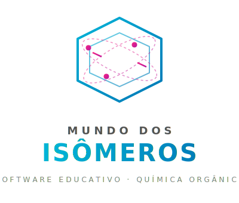

  

 

---

## Sobre o Projeto

**Mundo dos Isômeros** é um software educativo desenvolvido como ferramenta de apoio ao ensino de **Química Orgânica**, especificamente sobre **isômeros**. O projeto une teoria pedagógica — fundamentada na Teoria da Mediação Cognitiva (TMC) de Vigotski — com tecnologia interativa para tornar o aprendizado mais engajante e eficaz.

O software foi aplicado e validado em uma escola pública militar, com alunos do 3º ano do Ensino Médio, demonstrando resultados positivos na motivação e compreensão dos conceitos.

---

## Índice

- [Screenshots](#screenshots)
- [Fases do Jogo](#fases-do-jogo)
- [Abordagem Pedagógica](#abordagem-pedagógica)
- [Tecnologias](#tecnologias)
- [Como Jogar](#como-jogar)
- [Tese Acadêmica](#tese-acadêmica)
- [Equipe](#equipe)
- [Licença](#licença)

---

## Screenshots

  <table>
    <tr>
      <td align="center"> Apresentação</td>
      <td align="center"> Fase 1 — Roleta</td>
      <td align="center"> Fase 1 — Quiz</td>
    </tr>
    <tr>
      <td align="center"> Fase 2 — Jogo da Memória</td>
      <td align="center"> Fase 2 — Jogo da Memória</td>
      <td align="center"> Fase 3 — Jogo da Velha</td>
    </tr>
    <tr>
      <td align="center"> Nível Completo</td>
      <td align="center"> Leaderboard</td>
      <td></td>
    </tr>
  </table>

---

## Fases do Jogo

O jogo é dividido em **três fases**, cada uma com um formato único que combina mecânica lúdica com conteúdos de química orgânica:

### 🎡 Fase 1 — Isômeros Planos
> Roleta interativa + Quiz de múltipla escolha

Aborda isomeria plana: cadeia, posição, função, metamería e tautomeria.

### 🧠 Fase 2 — Isômeros Geométricos e Ópticos
> Jogo da Memória

Trabalha conceitos de isomeria geométrica (_cis/trans_) e isomeria óptica (isômeros dextro/levo).

### ❌ Fase 3 — Revisão Geral
> Jogo da Velha temático

Revisa todo o conteúdo das fases anteriores de forma cruzada e divertida.

---

## Abordagem Pedagógica

O software foi construído com base na **Teoria da Mediação Cognitiva (TMC)** de **Lev Vigotski**, que defende o aprendizado mediado por ferramentas e signos. Aqui, a tecnologia atua como instrumento mediador entre o aluno e o conhecimento, transformando conceitos abstratos de química em experiências interativas.

> *"O bom ensino é aquele que se adianta ao desenvolvimento."* — Lev Vigotski

### Diferenciais

- **Jogos, não só quizzes** — cada fase apresenta uma mecânica lúdica distinta, indo além do formato pergunta-resposta.
- **Contextualização visual** — uso de imagens e representações moleculares para conectar teoria e prática.
- **Feedback imediato** — o jogador recebe retorno constante sobre seu desempenho, promovendo a correção de rota em tempo real.

---

## Tecnologias

| Tecnologia | Finalidade |
|---|---|
| **HTML5** | Estrutura do jogo |
| **CSS3** | Estilização e layout responsivo |
| **JavaScript (Vanilla)** | Lógica do jogo e interatividade |
| **Supabase** | Leaderboard e persistência de dados |
| **CryptoJS** | Criptografia de dados no cliente |

---

## Como Jogar

1. Acesse o site do projeto (em breve link oficial).
2. Digite seu nome na tela inicial.
3. Escolha uma fase para começar.
4. Responda às perguntas e complete os desafios para avançar.
5. Acumule pontos e veja sua posição no **Leaderboard**!

> 💡 **Dica:** O jogo é otimizado para dispositivos móveis, a plataforma preferida da maioria dos alunos durante a pesquisa.

---

## Tese Acadêmica

Este projeto foi desenvolvido como parte de uma pesquisa acadêmica completa. A tese original está disponível para consulta:

  

---

## Equipe

<table align="center">
  <tr>
    <td align="center">
      
       <b>Octávio</b>
       Fullstack Developer
    </td>
    <td align="center">
      
       <b>Patrick</b>
       Front-end Developer
    </td>
  </tr>
</table>

---

## Licença

Distribuído sob a licença MIT. Veja [`LICENSE`](./LICENSE) para mais informações.

---

  Feito com ❤️ para transformar o ensino de Química Orgânica.
   
  Repositório original: <a href="https://github.com/DevFalconsz/Mundo-dos-Isomeros">DevFalconsz/Mundo-dos-Isomeros</a>

